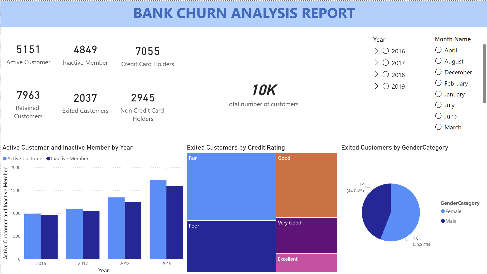

# 🏦 Bank Customer Churn Analysis — Power BI Dashboard


---

## 📌 Project Overview

This project analyzes **bank customer churn behavior** across 10,000+ customers spanning 2016–2019. The goal was to identify patterns that predict why customers leave the bank — and surface those insights through an interactive Power BI dashboard built for business stakeholders.

The analysis directly supports churn prevention strategy by answering:
- **Who** is churning? (demographics, geography, gender)
- **What** profile predicts churn? (credit rating, activity status, product usage)
- **When** is churn accelerating? (year-over-year trend)

---

## 📊 Dashboard Preview



---

## 🗂️ Data Sources

The dashboard was built by connecting and transforming **7 raw data sources** in Power Query:

| File | Description |
|---|---|
| `Bank_Churn.csv` | Core fact table — 10,007 customer records with churn flag, credit score, balance, tenure |
| `CustomerInfo.csv` | Customer ID to Surname mapping |
| `Geography.xlsx` | Lookup: GeographyID → France / Spain / Germany |
| `Gender.xlsx` | Lookup: GenderID → Male / Female |
| `ActiveCustomer.xlsx` | Lookup: ActiveID → Active Member / Inactive Member |
| `ExitCustomer.xlsx` | Lookup: ExitID → Exit / Retain |
| `CreditCard.xlsx` | Lookup: CreditID → Credit Card Holder / Non Credit Card Holder |

---

## ⚙️ Data Preparation (Power Query)

All data transformation was done inside **Power Query** before loading into the data model:

- **Joined all 7 tables** using merge queries on ID keys (GeographyID, GenderID, ActiveID, ExitID, CreditID)
- **Parsed `Bank DOJ`** date column to extract Year and Month for time-series slicing
- **Created `CreditRating` category** from raw CreditScore using conditional column logic:

  | Score Range | Rating |
  |---|---|
  | 800–850 | Excellent |
  | 740–799 | Very Good |
  | 670–739 | Good |
  | 580–669 | Fair |
  | 300–579 | Poor |

- **Cleaned dirty data** — `CustomerId` column contained `@?` characters on some rows; removed via text transformation
- **Handled nulls** in Tenure and IsActiveMember columns
- **Renamed columns** for business-friendly display names throughout the model

---

## 📐 Data Model

Star schema with `Bank_Churn` as the central fact table, connected to 5 dimension lookup tables via ID keys.

```
Bank_Churn (Fact)
    ├── Geography    [GeographyID]
    ├── Gender       [GenderID]
    ├── ActiveCustomer [IsActiveMember]
    ├── ExitCustomer   [Exited]
    └── CreditCard     [HasCrCard]

CustomerInfo joined separately on CustomerId
```

---

## 📈 Key KPIs (Dashboard Cards)

| KPI | Value |
|---|---|
| Total Customers | **10,000** |
| Active Members | **5,151** |
| Inactive Members | **4,849** |
| Retained Customers | **7,963** |
| Exited Customers | **2,037** |
| Credit Card Holders | **7,055** |
| Non Credit Card Holders | **2,945** |

> **Overall Churn Rate: 20.4%** — meaning 1 in 5 customers left the bank.

---

## 🔍 Business Insights

### 1. Germany has a disproportionately high churn rate
Despite having only ~25% of the customer base, Germany accounts for **816 exits** — nearly equal to France's 811 exits from 50% of customers. Germany's churn rate is roughly **double** that of France and Spain.

> **Recommendation:** Target Germany with retention campaigns and product engagement programs.

---

### 2. Inactive members are a major churn risk
**4,849 customers are inactive** — nearly half the customer base. Inactivity is a leading indicator of churn. The year-over-year bar chart confirms inactive member count grows each year alongside active members.

> **Recommendation:** Trigger re-engagement workflows for customers with 0 product interactions in 90+ days.

---

### 3. Female customers churn at a significantly higher rate
- Female churn rate: **25.1%**
- Male churn rate: **16.5%**

Despite females being fewer in total count (4,548 vs 5,459 males), they account for **1,140 exits vs 900 male exits**.

> **Recommendation:** Investigate gender-specific pain points — product fit, service experience, or communication channels.

---

### 4. Fair and Poor credit customers drive the most exits
Churn by credit rating:

| Credit Rating | Exited Customers |
|---|---|
| Fair | 675 |
| Poor | 530 |
| Good | 453 |
| Very Good | 254 |
| Excellent | 128 |

Customers with **Fair and Poor credit ratings account for 59% of all churn** — even though they're not the highest-risk segment by balance.

> **Recommendation:** Design early intervention touchpoints for customers with credit scores below 670.

---

### 5. Churn is accelerating year-over-year
Customer joins grew from 1,954 in 2016 to 3,316 in 2019 — but inactive members grew proportionally, suggesting onboarding isn't translating to engagement.

| Year | Active | Inactive |
|---|---|---|
| 2016 | 991 | 961 |
| 2017 | 1,094 | 1,049 |
| 2018 | 1,345 | 1,249 |
| 2019 | 1,722 | 1,593 |

> The active/inactive ratio has stayed nearly **1:1 across all years** — a systemic engagement gap, not a one-time spike.

---

## 🛠️ Tools Used

| Tool | Purpose |
|---|---|
| **Power BI Desktop** | Dashboard development, DAX measures, visual design |
| **Power Query (M)** | Data ingestion, transformation, joining all 7 source tables |
| **DAX** | KPI card measures, dynamic filtering with slicers |

---

## 📋 Business Requirement Document

The project was scoped using a formal **Business Requirement Document (BRD)** which defined:
- Data dictionary for all 14 fields in the fact table
- Business hypothesis for each churn predictor variable
- Data sources to be connected and merged
- Analytical objective: *"Identify what leads a client towards the decision to leave the company"*

---

## 💡 What This Project Demonstrates

- Connecting and merging **multiple heterogeneous data sources** (CSV + XLSX) in Power Query
- Building a clean **star schema data model** from raw ID-keyed lookup tables
- Applying **conditional column logic** to engineer a credit rating category from raw scores
- Designing **KPI cards, bar charts, treemaps, and pie charts** for executive-level reporting
- Using **slicers** (Year hierarchy, Month Name) for interactive, self-service filtering
- Deriving **actionable business insights** from descriptive analytics

---

## 👤 Author

**[Your Name]**  
Aspiring Data Analyst | Power BI · Power Query · SQL · Data Storytelling  
[LinkedIn](#) · [Portfolio](#)
